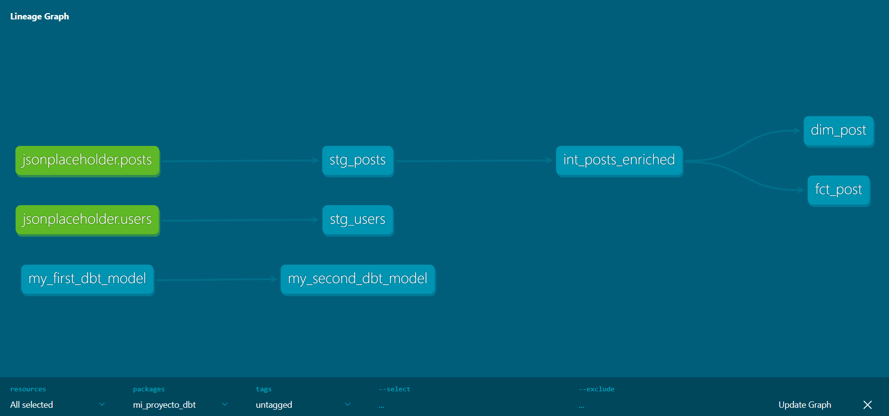
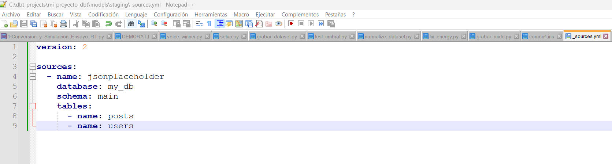
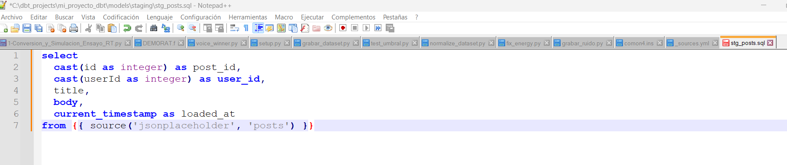
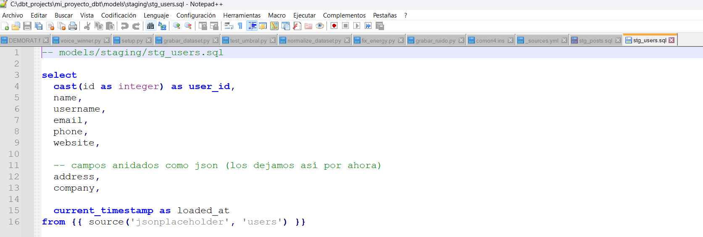
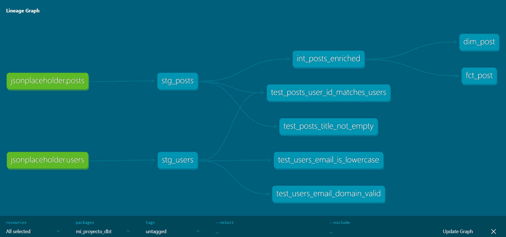

Proyecto dbt – Clase 5
📌 Descripción

Este proyecto implementa un pipeline de transformación en dbt utilizando datos provenientes de la API JSONPlaceholder (posts y users), cargados a MotherDuck mediante Airbyte.

Se implementa una arquitectura por capas:

Sources

Staging

Intermediate

Marts (modelo dimensional)
📂 Capas implementadas
🔹 Sources

jsonplaceholder.posts

jsonplaceholder.users

Definidos en _sources.yml.

🔹 Staging

stg_posts

stg_users

Transformaciones:

Cast de IDs

Normalización de nombres de columnas

Inclusión de campo loaded_at

🔹 Intermediate

int_posts_enriched

Join entre posts y users para enriquecer los datos.

🔹 Marts

Modelo dimensional compuesto por:

dim_post

fct_post

Separación en dimensión y tabla de hechos.

📊 DAG generado por dbt docs

El grafo de dependencias fue generado con: 
dbt docs generate
dbt docs serve
Incluye:

2 modelos staging

1 modelo intermediate

2 modelos mart

2 sources
⚙️ Tecnologías utilizadas

dbt

DuckDB / MotherDuck

Airbyte

JSONPlaceholder API

🎯 Conclusión

El proyecto demuestra la implementación completa de un flujo ELT moderno:

Airbyte (Extract & Load) → MotherDuck (Storage) → dbt (Transform).

Se aplicó modelado por capas, separación dimensional y documentación automática mediante dbt docs, cumpliendo con los requisitos establecidos en la consigna.

# Clase 6 - Data Quality y Testing con dbt

En esta clase se implementaron mecanismos de control de calidad de datos utilizando dbt.

## dbt-expectations

Se instaló el paquete `dbt-expectations` para ampliar las capacidades de testing en dbt.

Instalación mediante: packages.yml
Luego se ejecutó: dbt deps

Esto permitió utilizar tests avanzados como validación de regex y rangos de valores.

---

# Tests implementados

## Tests genéricos (dbt)

Se implementaron los siguientes tests genéricos:

- `not_null`
- `unique`
- `relationships`

Aplicados principalmente sobre:

- `stg_posts`
- `stg_users`

Estos tests garantizan integridad básica de los datos.

---

## Tests con dbt-expectations

Se implementaron tests adicionales utilizando `dbt-expectations`:

- Validación de rango de valores (`expect_column_values_to_be_between`)
- Validación de emails mediante regex (`expect_column_values_to_match_regex`)
- Validación de valores no nulos (`expect_column_values_to_not_be_null`)

Esto permite controles de calidad más avanzados.

---

## Tests personalizados (Singular Tests)

Se crearon tests personalizados en la carpeta `/tests`:

- `test_posts_title_not_empty`
- `test_posts_user_id_matches_users`
- `test_users_email_domain_valid`
- `test_users_email_is_lowercase`

Estos tests permiten validar reglas de negocio específicas.

---

# Documentación

Se documentaron:

- Sources
- Modelos
- Columnas clave

La documentación fue generada mediante: dbt docs generate y dbt docs generate

---

# DAG del proyecto

El siguiente gráfico muestra el flujo de dependencias del proyecto dbt.

---

# Validación final

Todos los tests fueron ejecutados exitosamente mediante: dbt build

Resultado:

- Models ejecutados correctamente
- Tests aprobados
- Documentación generada

